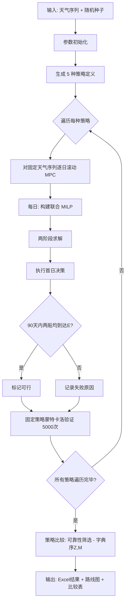

<!--
===============================================================================
  2026B 任务4「团队合作」数学建模——宏节点 MPC 联合 MILP 方案论证说明
  涵盖：建模思路 / 数学推导 / 约束体系 / 两阶段优化 / 机会约束 / 策略设计 / 验证框架
===============================================================================
-->

# 任务4「团队合作」数学模型——详细论证说明

---

## 目录

1. 问题重述与建模挑战
2. 核心建模思路
3. 宏节点时空网络构建
4. MILP 决策变量体系
5. 约束条件详述
6. 目标函数：两阶段字典序优化
7. 不确定性建模与机会约束
8. 滚动时域 MPC 框架
9. 策略比较与选择机制
10. 蒙特卡洛验证
11. 模型完整工作流
12. 模型优缺点与改进方向
13. 符号速查表

---

## 一、问题重述与建模挑战

### 1.1 问题背景

两艘同配置船舶同时从起点 B(1,15) 出发，须在 90 天内安全抵达终点 E(30,15)。网格 30×30，含 2 个补给平台 S1(12,16)、S2(21,16) 和 3 个作业点 W1(6,21)、W2(15,9)、W3(24,24)。每日天气为"正常"（概率 0.8）或"雷暴"（概率 0.2），不同天气下移动/停泊/作业消耗不同。

每船初始资源：淡水 O=100，燃油 H=150，食物 F=100，资金 M=750，目标物资 Z=200。载重上限 400 单位。

**协作机制**：当两船处于同一网格点时，在当日行动前可相互交换消耗性物资（O/H/F）和资金（M），目标物资 Z 不可交换。一船抵达 E 并完成交接后即退出任务。

### 1.2 核心建模挑战

| 挑战 | 描述 |
|---|---|
| 组合爆炸 | 30×30 网格 × 90 天 × 2 船 × 4 行动类型，状态空间巨大 |
| 随机天气 | 未来天气不可预知，仅知道 P(正常)=0.8 |
| 实时耦合 | 两船位置、资源、会合时机相互依赖 |
| 99% 可靠性 | 需要在不确定性下保证高概率安全抵达 |
| 双目标 | 先最大化团队总 Z，再最大化剩余总 M |

---

## 二、核心建模思路

### 2.1 三项关键技术

```
+-------------------------------------------------------------+
|                   任务4：团队合作建模框架                      |
+-------------------------------------------------------------+
|  1) 宏节点时空网络    将 900 个网格点压缩为功能节点组成的       |
|                       稀疏图，以曼哈顿距离为弧的持续时间       |
|                                                             |
|  2) 滚动时域 MPC      每日求解 H=15 天的前瞻 MILP，仅执行      |
|                       第一天的决策，次日根据天气观测重优化     |
|                                                             |
|  3) 联合 MILP         在同一优化问题中同时建模两船行动、       |
|                       补给采购、会合交换、作业收益             |
+-------------------------------------------------------------+
```

### 2.2 为什么选择宏节点 + MPC

精细网格（900 点）的直接 MILP 会产生 900 × 90 × 2 ≈ 162,000 个位置变量，加上弧变量、作业变量等，变量数极度膨胀，intlinprog 无法在合理时间内求解。宏节点将变量规模压缩至 O(nNode × H × K)，其中 nNode ≈ 10~20（动态插入途经坐标）。

MPC 滚动优化利用了"每日可观测当日天气"这一信息结构：未来消耗按期望值规划，实际执行根据真实天气消耗，每日重新优化修正偏差。

---

## 三、宏节点时空网络构建

### 3.1 节点集定义

设 N 为当前规划窗口内所有可用节点的集合：

N = UniqueRows({p1, p2} ∪ T ∪ {B, S1, S2, W1, W2, W3, E})

其中 p_k 为船舶 k 当日所在位置，T 为上一窗口已承诺但未完成的目标节点。|N| 记为 nNode。

### 3.2 功能标志

对每个节点 i ∈ N，定义功能标志：

isFunctional(i) = 1 若 n_i ∈ {B, S1, S2, W1, W2, W3, E} ∪ T；否则 0

只有功能节点可作为弧段目的地。中继坐标仅是途经的临时停留点。

### 3.3 宏移动弧

对于节点对 (i, j)，若满足：
- i ≠ E（E 只进不出）
- j 为功能节点（isFunctional(j) = 1）
- 曼哈顿距离 1 ≤ d_ij = ||n_i - n_j||_1 ≤ H

则创建宏移动弧 a = (i, j)，其持续时间为 d_ij 天。弧集合记为 A，弧数记为 nArc。

> **设计原理**：宏弧的目标节点必须是功能节点，避免两船相互追逐对方的中间坐标（这种追逐在每日滚动中会产生不可控的震荡）。途经的非功能坐标只在弧的逐步执行中自然出现。

---

## 四、MILP 决策变量体系

设前瞻窗口长度为 H（默认 15 天），时间索引 t = 1, 2, ..., H, H+1。所有变量按船舶 k ∈ {1, 2} 分别定义。

### 4.1 位置与移动变量

| 变量 | 维度 | 类型 | 含义 |
|---|---|---|---|
| x_k(i, t) | nNode × (H+1) | 0-1 | 船舶 k 第 t 天开始时位于节点 i |
| travel_k(a, t) | nArc × H | 0-1 | 船舶 k 第 t 天开始沿弧 a 移动 |
| stay_k(i, t) | nNode × H | 0-1 | 船舶 k 第 t 天在节点 i 停泊 |
| work_k(w, t) | nW × H | 0-1 | 船舶 k 第 t 天在作业点 W_w 作业 |

### 4.2 补给与状态变量

| 变量 | 维度 | 类型 | 含义 |
|---|---|---|---|
| buy_k(r, s, t) | 3 × 2 × H | 连续整数 | 第 t 天在补给平台 S_s 采购资源 r 的数量 |
| state_k(g, t) | 4 × (H+1) | 连续 | 第 t 天初资源状态：g=1:O, g=2:H, g=3:F, g=4:M |

### 4.3 会合与交换变量

| 变量 | 维度 | 类型 | 含义 |
|---|---|---|---|
| meet(i, t) | nNode × H | 0-1 | 第 t 天两船在节点 i 会合 |
| trNet(g, i, t) | 4 × nNode × H | 整数 | 在节点 i 第 t 天船 1→船 2 的净转移量（正=1→2，负=2→1） |
| trAbs(g, i, t) | 4 × nNode × H | 连续 | 转移绝对值（辅助线化 |·|） |

### 4.4 整数标记汇总

二进制变量：所有 x_k, travel_k, stay_k, work_k, meet。
整数变量：buy_k（连续整数上界为 Q=400）、trNet（中界为 ±U_g，U_{1,2,3}=400, U_4=1500）。

---

## 五、约束条件体系

以下用 O(i) 表示以 i 为起点的弧，I(j) 表示以 j 为终点的弧。

### 5.1 流守恒约束

**每艘船在每个节点的流入流出平衡：**

对于每个 k ∈ {1,2}，每个 i ∈ N，每个 t ∈ [1, H] 有两组约束：

**(1) 流出量 = 当日初始位置量**

∑ travel_k(a, t) [a: from(a)=i] + stay_k(i, t) + 1_{i∈W} · work_k(idxW(i), t) = x_k(i, t)

**(2) 次日位置 = 流入量 + 原地停留/作业**

x_k(i, t+1) = stay_k(i, t) + 1_{i∈W} · work_k(idxW(i), t) + ∑ travel_k(a, t-d(a)+1) [a: to(a)=i, t-d(a)+1 ≥ 1]

这确保了：(a) 每天最多一个行动；(b) 在弧上连续 d(a) 天最终到达目的地。

### 5.2 会合与交换约束

**会合定义** —— 两船在时刻 t 处于同一节点 i：

meet(i, t) ≤ x_1(i, t)
meet(i, t) ≤ x_2(i, t)
x_1(i,t) + x_2(i,t) - meet(i,t) ≤ 1

当 meet(i,t)=1 时 x_1(i,t)=x_2(i,t)=1；当 meet(i,t)=0 时二者可能不同时为 1。

**交换量约束** —— 仅在允许会合的节点上可进行非零交换：

对于每个 g ∈ {1,2,3,4}，每个 i，每个 t：

-U_g · meet(i,t) ≤ trNet(g,i,t) ≤ U_g · meet(i,t)

其中 U_{1,2,3}=400（载重上限），U_4=1500（资金上限）。

对于策略中禁止交换的节点，强制 trNet = 0（上/下界均置零）。

**交换绝对值的辅助约束**（用于目标函数中最小化总交换量）：

trNet(g,i,t) ≤ trAbs(g,i,t),  -trNet(g,i,t) ≤ trAbs(g,i,t)

### 5.3 资源与资金平衡约束

**执行顺序**：交换 → 补给采购 → 行动消耗 → 次日状态（与问题描述一致：当日行动前先交换，再采购，再行动消耗）。

**消耗资源 r ∈ {1,2,3}（O/H/F）的平衡：**

state_k(r, t+1) = state_k(r, t)
  + sign_k · ∑_i trNet(r, i, t)                    （交换, sign_1=-1, sign_2=+1）
  + ∑_{s∈{S1,S2}} buy_k(r, idxS(s), t)              （补给采购）
  - ∑_{a∈A} C^move_r(a,t) · travel_k(a, t)          （移动消耗）
  - ∑_{i∉E} C^idle_r · stay_k(i, t)                  （停泊消耗）
  - ∑_w C^work_r · work_k(w, t)                      （作业消耗）

**消耗系数的当日/远期处理**：
- 当 t=1（今日）：使用真实天气 ω_today 下的实际消耗系数 C(ω_today)
- 当 t ≥ 2（未来日）：使用概率加权期望消耗 C̄ = 0.8·C_normal + 0.2·C_storm

这恰好体现了"今日信息已知、未来仅知分布"的信息结构。

**资金平衡**：

state_k(4, t+1) = state_k(4, t) + sign_k · ∑_i trNet(4,i,t) - ∑_{r,s} p^price_r · buy_k(r,s,t)

其中 p^price = [2, 1, 2]（分别为燃油 O、淡水 H、食物 F 的单价）。

### 5.4 载重约束

在交换后和采购后，三种消耗性物资之和不得超过载重上限 Q=400：

state_k(1,t) + state_k(2,t) + state_k(3,t) + ∑_{r,s} buy_k(r,s,t) ± ∑_i ∑_{r=1}^3 trNet(r,i,t) ≤ Q

### 5.5 连续作业约束

每个作业点 W_w 的连续作业天数不得超过 L_w（W1=4, W2=5, W3=3）：

对于每个 k, w, t₀ ∈ [1, H-L_w]：∑_{τ=t₀}^{t₀+L_w} work_k(w, τ) ≤ L_w

对窗口初已部分完成的历史作业块，在 MILP 窗口内施加剩余天数限制：

若 hist(w) = c > 0：∑_{τ=1}^{min(H, L_w-c+1)} work_k(w, τ) ≤ L_w - c

其中 hist(w) 为上一窗口在 W_w 已连续作业的天数。

### 5.6 窗口终端安全约束

**完全前瞻窗口**（H = fullRemaining）：强制末天到达 E：

x_k(E, H+1) = 1

**部分前瞻窗口**（H < fullRemaining）：

(1) 终端位置必须满足"后续天数足够抵达 E"：

x_k(i, H+1) = 0  若 ||n_i - E||_1 > fullRemaining - H

(2) 终端资源必须满足安全撤离条件——在给定的置信水平 α 下，足够的资源从当前位置直抵 E：

∑_{i∈N} Req_r(||n_i - E||_1, α) · x_k(i, H+1) ≤ state_k(r, H+1)

其中 Req_r(d, α) 是连续移动 d 天时、以置信水平 α 需要预留的资源 r 的数量（推导见第 7 节）。

### 5.7 宏弧承诺与特殊约束

**已承诺弧的强制完成**：若船舶 k 在上一窗口已开始一条宏弧并承诺了目标 t_k，则当日必须继续沿该方向移动：

stay_k(startIdx_k, 1) = 0
travel_k(a, 1) = 0  对于所有 a: n_to(a) ≠ t_k

**已抵达船舶的固定**：若 k 已抵达 E，则 x_k(E, t) = 1, x_k(i, t) = 0 (i ≠ E) 对所有 t。

**无效弧禁用**：移动弧持续时间 d(a) 超过窗口剩余天数，或弧以 E 为起点均不可用：

travel_k(a, t) = 0  若 d(a) > H-t+1 或 from(a)=E

**角色禁止的工作点**：根据策略定义，某些船舶可能禁止在特定作业点工作：

work_k(w, t) = 0  若 allowedWork(k,w)=0

**撤离期禁止作业**：当剩余天数 ≤ 40 天时（撤离窗口），禁止所有新作业：

work_k(w,t) = 0  若 fullRemaining ≤ 40

---

## 六、目标函数：两阶段字典序优化

**问题要求**：在所有使抵达时总 Z 最大的方案中，选择使剩余总 M 最大的方案。

### 6.1 第一阶段：最大化团队总 Z

max  ∑_{k=1}^2 ∑_{w=1}^3 ∑_{t=1}^H  R_w · work_k(w, t)

其中 R = [20, 15, 28] 为 W1、W2、W3 的作业收益。求解后得到最优值 Z*。

### 6.2 第二阶段：固定 Z*，最大化团队总 M

在第一阶段约束的基础上，追加：

∑_{k,w,t} R_w · work_k(w,t) = Z*

新的目标函数为：

min  -state_1(4, H+1) - state_2(4, H+1)    （最大化终端总资金）
    + ε₁ ∑_{g,i,t} trAbs(g,i,t)             （Tie-breaking: 最小化总交换量）
    + ε₂ ∑_{k,i} d(i,E) · x_k(i,H+1)         （Tie-breaking: 终端更靠近 E）
    + ε₃ ∑_{k,i∉E} stay_k(i,1)               （Tie-breaking: 不鼓励首日原地停留）

**Tie-breaking 惩罚项的作用**：

| 项 | 系数 | 含义 |
|---|---|---|
| ∑ trAbs | ε₁ < 0.19/(1+∑U_g) | 同等 M 时选中交换量最小的解，减少不必要的资源搬运 |
| ∑ d(i,E)·x_k(i,H+1) | ε₂ < 0.19/(1+2d_max) | 同等 M 时终端位置更靠近 E，为后续窗口减少距离压力 |
| ∑ stay_k(i,1) | ε₃ = 0.19/2 | 同等 M 时不鼓励第一天原地停留 |

> **关键设计**：所有惩罚项总和严格小于 1 单位资金，确保它们不会以牺牲资金换取更少的交换或其他次要目标。系数的选择 0.19/(...) 使用 0.19 而非 0.25 是为了留出数值精度的安全边界。

### 6.3 为什么用字典序而非加权和

加权和 max αZ + βM 的问题在于：
- 无法先验地确定权重 α, β 使 Z 的优先级绝对高于 M
- 不同的天气实现可能导致不同的 Z/M 帕累托前沿
- 两阶段法严格保证了字典序：任何牺牲 Z 换取 M 的解都不可能在第一阶段胜出

---

## 七、不确定性建模与机会约束

### 7.1 未来消耗的期望值处理

未来日（t ≥ 2）的资源消耗系数使用期望值：

C̄ = 0.8 · C_normal + 0.2 · C_storm

例如：正常移动消耗 O=2, H=3, F=2；雷暴移动消耗 O=8, H=4, F=3；期望移动消耗 O=3.2。

### 7.2 机会约束安全裕量推导

仅凭期望消耗规划可能因为连续雷暴天而耗尽资源。为此，对每种资源 r 施加安全裕量。

设未来有 n 天不确定性，雷暴天数 S ~ Binomial(n, p_s)。对每种资源 r 定义最大正向偏差和最小偏差：

δ_r^max = max_action (C^storm_r(action) - C^normal_r(action))
δ_r^min = min_action (C^storm_r(action) - C^normal_r(action))

给定置信水平 α，安全裕量为：

Reserve_r(n) = max(0, q · δ_r^max - n·p_s · δ_r^min)

其中 q = BinomialQuantile(n, p_s, α) 是二项分布的 α-分位数——"在置信水平 α 下，雷暴天数不超过 q 天"。

**二项分位数的递推计算**（不依赖 Statistics Toolbox）：

```
q = 0
term = (1-p_s)^n
cdf = term
while cdf + 1e-15 < α and q < n:
    term = term * (n-q)/(q+1) * p_s/(1-p_s)
    q = q + 1
    cdf = cdf + term
```

### 7.3 风险预算分配

总体可靠性目标为 99%（α_total = 0.99）。将风险预算分配到每个规划窗口：

riskPieces = max(1, 2 · ⌈fullRemaining / max(1, H)⌉)

单窗口置信水平：

α_window = 1 - (1 - 0.99) / riskPieces

> **为什么要 ×2**：系数 2 是保守因子——实际窗口数可能少于 ⌈T/H⌉（因为船舶提前到达 E 后不再规划），且二项分位数的离散跳跃可能导致实际覆盖概率略低于名义值。

### 7.4 终端安全撤离需求

窗口末端的船舶如果距离 E 还有 d 天，必须在 d 天内持续移动至 E。在 d 天中，雷暴天数的 α-分位数为 q = BinomialQuantile(d, p_s, α)，所需资源 r 的量为：

Req_r(d) = d · C^normal_r(move) + q · (C^storm_r(move) - C^normal_r(move))

### 7.5 此方法的局限性与应对

机会约束不是解析的 99% 保证，而是将单窗口规划置于保守的确定性等价中。**真实可靠性由独立蒙特卡洛验证给出**（见第 10 节），这是两种方法的分工：

| 环节 | 方法 | 作用 |
|---|---|---|
| 规划 | 期望消耗 + 分位数安全裕量 | 生成保守但可解的确定性 MILP |
| 验证 | 5000 次独立天气实现蒙卡复现 | 报告固定策略的真实成功率和 95% Wilson 置信下界 |

---

## 八、滚动时域 MPC 框架

### 8.1 算法流程

```
输入: 策略 strategy, 天气序列 weather[1..T], 参数 p
输出: 每日行动方案、资源轨迹、是否可行

for t = 1 to T:
    if 两船均已到达 E: break

    H = min(p.lookahead, T - t + 1)       # 前瞻窗口长度

    构建 MILP 模型:
        node set   ← 当前位置 + 功能节点 + 已承诺目标
        arc set    ← 节点对曼哈顿距离 ∈ [1, H]，目标为功能节点
        variables  ← 按第 4 节定义
        constraints ← 按第 5 节定义

    两阶段求解:
        (x_Z) ← intlinprog(最大化 Z, 5s时限, 2%相对间隙)
        (x_M) ← intlinprog(最大化 M | Z=Z*, 5s时限, 2%相对间隙, 热启动 x_Z)

    提取第 1 天的决策:
        action(t)   ← 移动方向 / 停泊 / 作业
        buy(t)      ← 采购量
        transfer(t) ← 交换量

    执行决策:
        消耗 = if 今日雷暴: storm_consumption else: normal_consumption
        更新: position, resources, money, Z, work_history, target_commitment

下一日: t ← t + 1
```

### 8.2 关键设计决策

**仅执行首日决策**：MILP 为整个 15 天窗口生成了完整的行动方案，但只在当日执行第一步。因为：
- 次日天气可能与规划中假设的概率加权天气不同
- 重新优化可以修正因实际天气偏差导致的资源偏离

**宏弧承诺的保留**：如果 MILP 决定开始一条宏弧（如从当前位置移动到 W1，弧长 d 天），次日重新优化时该承诺作为硬约束保留——船舶不能中途放弃已开始的弧。这是为了防止船舶在弧段中不断改变目标、浪费移动消耗。该承诺在抵达目标节点时释放（target = [NaN, NaN]）。

**求解后状态验证**：每次求解后，代码不仅检查 intlinprog 的退出标志，还显式验证返回向量的约束违例：

```
ineqViolation = max(0, A*x - b)
eqViolation  = max(|Aeq*x - beq|)
boundViolation = max(0, lb - x, x - ub)
integerViolation = max(|x(intcon) - round(x(intcon))|)

if max(以上) > 1e-5: 拒绝该解并报告失败
```

这防止了因数值异常或超时导致的不可行解进入实际执行。

---

## 九、策略比较与选择机制

### 9.1 五种策略定义

| # | 策略名 | 允许交换 | 作业分配 | 会合节点 |
|---|---|---|---|---|
| 1 | 不合作基线 | 否 | 两船均可作业所有 W | 无 |
| 2 | 自由同点协同 | 是 | 两船均可作业所有 W | 任意同点 |
| 3 | 船1主作业·船2支援 | 是 | 船1作业，船2不作业 | S1,S2,W3 |
| 4 | 分工—S2会合 | 是 | 船1:W1,W2; 船2:W3 | S2 |
| 5 | 双船集中W3 | 是 | 两船均仅作业 W3 | S2,W3 |

### 9.2 选择逻辑

```
1. 筛选: 蒙特卡洛 Wilson 95% 置信下界 ≥ 99% 的策略
2. 在通过筛选的策略中:
      按 (teamZ 降序, teamM 降序) 字典序选择最优
3. 若无策略通过可靠性筛选:
      退而求其次——选择 teamZ 最大且可行的策略
      输出警告: 可靠性未经统计验证
```

策略 1（不合作基线）作为参照——所有协作策略的 Z 增益均相对于它计算。

---

## 十、蒙特卡洛验证

### 10.1 验证目标

MILP 中的机会约束只提供确定性等价近似，不能作为解析的 99% 可靠性证明。因此，用独立于优化天气的 5000 个天气样本，对已产出的固定决策序列进行复现验证。

### 10.2 验证流程

```
输入: 每日决策序列 (buy, transfer, actionType)
      nSamples = 5000, seed = originalSeed + 100000 (保证独立)

for sample = 1 to nSamples:
    生成独立天气序列 (weather ~ Bernoulli(p_normal) for each day)

    for t = 1 to nDays:
        执行 transfer → buy → action
        按实际天气决定消耗
        检查: 任何资源 < 0 或超载 → 失败

    if 全程无违例: successes++

successRate = successes / nSamples
```

### 10.3 Wilson 置信区间

对成功率 p̂ = successRate，计算 Wilson Score 95% 置信下界：

lower_95 = [p̂ + z²/(2n) - z·√(p̂(1-p̂)/n + z²/(4n²))] / [1 + z²/n]

其中 z = Φ^(-1)(0.95) ≈ 1.645。

当 lower_95 ≥ 0.99 时，认为有 95% 的置信度相信真实成功率不低于 99%。

### 10.4 验证的局限性

此验证仅检查资源可行性（消耗不超过持有量），不追踪实际网格位置。完整的策略验证还需要确认：
- 船舶每日位置与规划位置一致
- 会合确实发生在同一网格点
- 补给采购确实在 S 节点进行

但在本模型中，每日 MPC 执行保证了位置一致性（单步移动 by `oneStep`），且决策序列来自 MILP 输出，因此此简化验证的偏差有限。

---

## 十一、模型完整工作流



---

## 十二、模型优缺点与改进方向

### 12.1 优点

| 优点 | 说明 |
|---|---|
| 联合 MILP 全局优化 | 两船行动+交换+补给在一个优化问题中同时求解，而非两阶段解耦 |
| 滚动时域信息利用 | 充分利用"每日可观测当日天气"的信息增量，每日修正偏差 |
| 字典序保证最优性 | 严格保证在 Z 最大的前提下最大化 M，不会出现权重选取不当的偏离 |
| 多策略系统比较 | 从不合作基线到高度协作，覆盖面广，便于论证协作增益 |
| 独立蒙卡验证 | 5000 次样本外复现独立于优化过程，统计置信度可量化 |
| 求解鲁棒性 | 验证了 intlinprog 返回向量的 MILP 约束可行性，防止数值异常传播 |

### 12.2 缺点与风险

| 缺点 | 风险等级 | 说明 |
|---|---|---|
| 宏节点抽象损失协作机会 | 高 | 仅在功能节点可交换，忽视了 900 点中绝大部分可能的会合点 |
| 节点集动态膨胀 | 中 | 途经坐标逐步加入导致 MILP 规模不可控增长 |
| 宏弧硬承诺抵消滚动灵活性 | 中 | 已开始弧必须完成，雷暴天无法改道 |
| 机会约束过于保守 | 中低 | 风险预算分片 ×2 导致前期资源过度预留 |
| 5s 求解时限紧张 | 中低 | 超时解逐步累积误差 |
| 蒙卡验证不跟踪真实位置 | 中低 | 仅验证资源可行性，未仿真网格位置合法性 |
| 终点 E 处没有资源交接 | 低 | 先到船的剩余资源无法转移给后到船 |

### 12.3 改进方向

1. **弧段中继会合**：在功能节点之间的曼哈顿路径上每 N 步插入中继会合点（N=5~8），扩展有效会合机会而不显著增加变量数
2. **软弧承诺**：允许在连续雷暴天时，以罚函数形式放弃当前弧段、驶向最近的安全补给点
3. **自适应求解时间**：根据 MILP 规模动态调整 maxSolveTime，小型窗口可以用更严格的间隙
4. **终点交接**：在 E 节点增加一次性资源转移逻辑
5. **精细网格的启发式替代**：如用 A* 搜索为每船生成候选路径，在候选路径交叉点插入会合节点，然后用 MILP 做路径选择+时序协调

---

## 十三、符号速查表

| 符号 | 含义 | 取值 |
|---|---|---|
| T | 总天数 | 90 |
| p_n, p_s | 正常/雷暴天气概率 | 0.8, 0.2 |
| Q | 载重上限 | 400 |
| H | 前瞻窗口长度 | 15 |
| nNode | 窗口内节点数 | 动态, ~10-20 |
| nArc | 窗口内弧数 | 动态 |
| nW | 作业点数量 | 3 |
| nS | 补给平台数量 | 2 |
| E | 终点坐标 | (30, 15) |
| B | 起点坐标 | (1, 15) |
| S1, S2 | 补给平台坐标 | (12,16), (21,16) |
| W1, W2, W3 | 作业点坐标 | (6,21), (15,9), (24,24) |
| R_w | 作业收益 | [20, 15, 28] |
| L_w | 最大连续作业天数 | [4, 5, 3] |
| p^price_r | 补给单价 | [2, 1, 2] |
| C^normal_move | 正常天气移动消耗 | [2, 3, 2] |
| C^normal_idle | 正常天气停泊消耗 | [1, 1, 1] |
| C^normal_work | 正常天气作业消耗 | [5, 4, 3] |
| C^storm_move | 雷暴天气移动消耗 | [8, 4, 3] |
| C^storm_idle | 雷暴天气停泊消耗 | [3, 3, 2] |
| C^storm_work | 雷暴天气作业消耗 | [8, 6, 6] |
| α_total | 目标可靠性 | 0.99 |
| n_MC | 蒙特卡洛样本数 | 5000 |

---

*文档生成日期：2026-07-21*
*对应代码：task4_cooperative_macro_mpc.m*